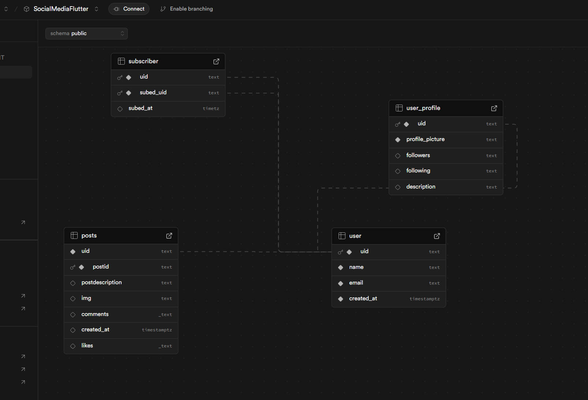
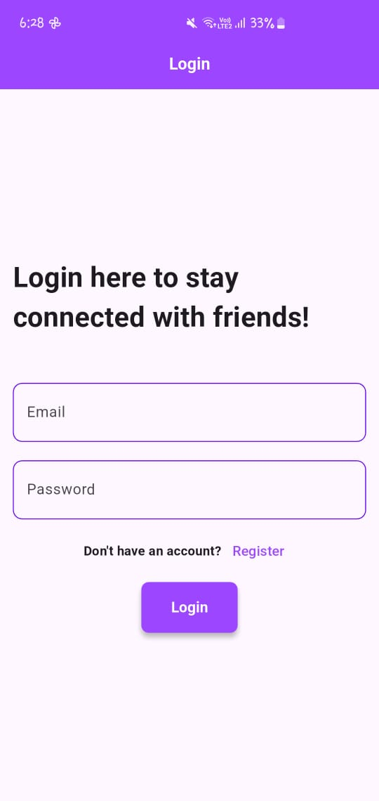
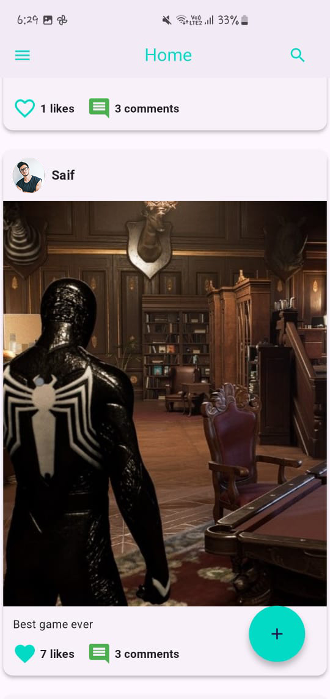
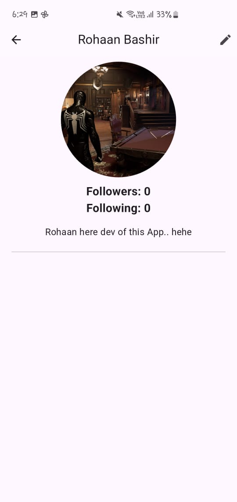
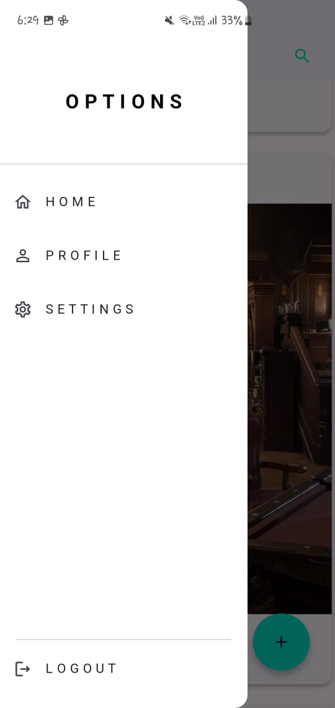
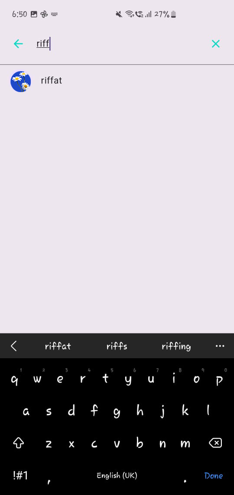
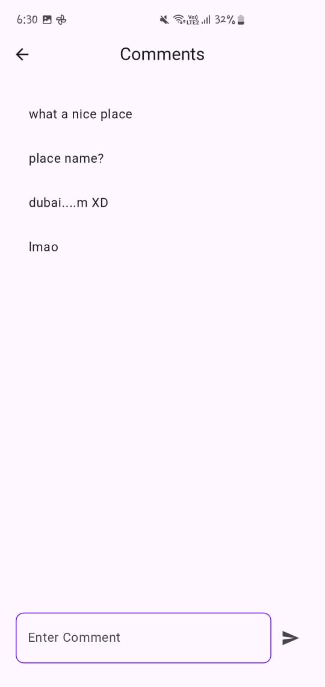
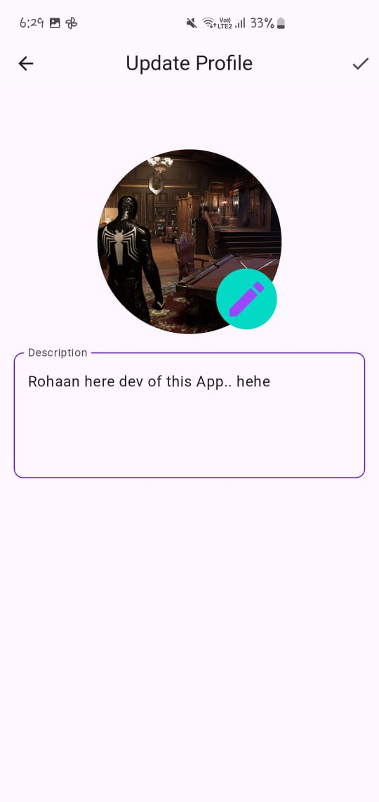

# 🌐 Flutter Social Media App

A scalable and maintainable **social media application** built using **Flutter**, designed with **CLEAN Architecture** for robust and testable code. This app integrates **Supabase** for seamless backend and data management and utilizes **BLoC (Business Logic Component)** for efficient state management.

> 🚧 **Note:** This app is still under development.

---

## ✨ Features

- 🔐 **Authentication**
  - Login
  - Registration

- 🏠 **Home Page**
  - View all posts
  - Navigate to comments and profiles

- 📝 **Post Creation**
  - Create new posts with text/media support *(media support coming soon)*

- 💬 **Comments**
  - Add and view comments on posts

- 🙋‍♂️ **Profile Management**
  - View other users' profiles
  - Edit your own profile (username, bio, etc.)

- 🔍 **Search User**
  - Search and view other users' profiles by username

- 🎯 **State Management**
  - BLoC architecture for clean separation of UI and business logic

- 📱 **Responsive UI**
  - Optimized for both mobile and tablet devices

---

## 🛠️ Tech Stack

| Layer               | Technology         |
|--------------------|--------------------|
| UI                 | Flutter            |
| Architecture       | CLEAN Architecture |
| State Management   | BLoC               |
| Backend/Database   | Supabase           |
| Authentication     | Supabase Auth      |

---

## 📸 database diagram

<div style="display: flex; gap: 10px; flex-wrap: wrap;">
  
 
</div>

## 📸 Screens

- Login Page
- Register Page
- Home Page
- Make Post Page
- Comments Page
- Profile Page
- Edit Profile Page
- Search User Page


<div style="display: flex; gap: 10px; flex-wrap: wrap;">
  
  
  
  
  
  
  
  
</div>
---

## 🚀 Getting Started

### 1. Clone the Repository
```bash
git clone https://github.com/your-username/flutter-social-app.git
cd flutter-social-app
